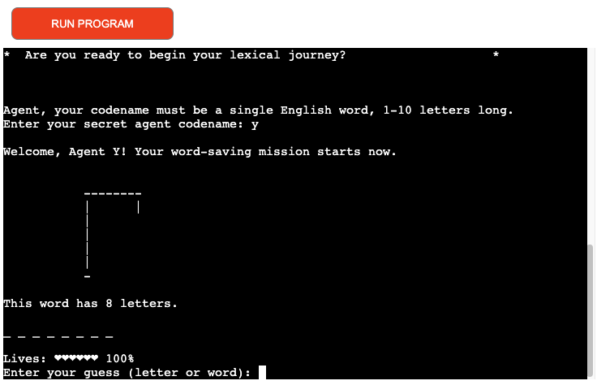
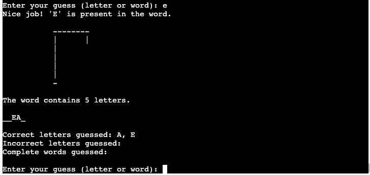
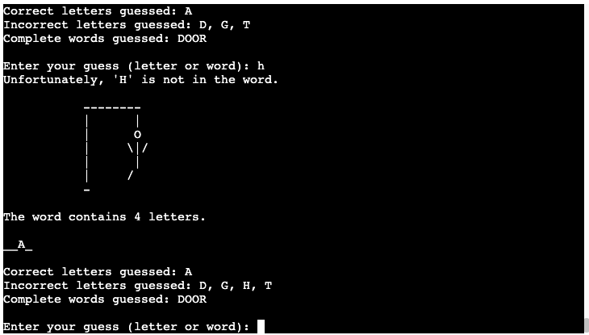

# Hangman 
Hangman is a Python-based terminal game that operates within the Code Institute's simulated terminal environment and is hosted on Heroku.

In this game, players will be challenged to figure out a randomly chosen word. They can make guesses by typing individual letters or entire words. The aim is to correctly guess the word and save the character from being hanged before running out of attempts.

[View live project here.](https://hangman-ys-2df0aca42caa.herokuapp.com/)

## How to play
Initially, players will be prompted to enter their name, which will start the game.

A word related to espionage will be randomly selected, with each letter represented by an **_** symbol, revealing the total number of letters in the word.

Players will then be asked to enter a letter or attempt to guess the entire word.

Guesses must consist of letters from the English alphabet. Word guesses must match the length of the given word and only include English alphabet characters.

Correct letter guesses will replace the corresponding **_** symbols with the correct letters. For each incorrect guess, whether a letter or a whole word, the player will lose a life, bringing the character one step closer to being captured and hanged.

Upon successfully identifying the word, players will receive a congratulatory message and an option to play again.

If players run out of lives, the character will, unfortunately, be captured and hanged. A message of commiseration will be presented, along with an opportunity to try again.

Players will also be reminded of any letters they have already guessed, prompting them to guess again without losing a life for repeated guesses.

## Game Mechanics 
A flowchart detailing the game's mechanics was designed using [draw.io](https://app.diagrams.net/ "draw.io"). Before diving into coding, I always draft a plan, sketching out the code structure, which is why I opted for the same method in my flowchart. You can view the flowchart by clicking the link below.

[Game Flowchart](docs/flowchart/hangmandraw.png)

## Features

### Welcome Message 

When the game loads, users will see a welcome message explaining the gameplay and instructions on how to start.

### Username Promtp

#### Agent Name Requirements (Username):

* The name must be between 1 and 10 characters in length.

* Only letters from the standard English alphabet are allowed—no numbers, spaces, or special characters.

If a player attempts to enter an invalid agent name, they will receive an error message explaining the issue and prompting them to enter a valid name. Once a compliant agent name is provided, the game will proceed, immersing the player in the espionage-themed challenge. This step ensures that each player starts with a unique and valid identifier, enhancing both personalization and the thematic experience of the game.

*Username Input* 

*Username Input* 

### Hangman Gallows

At the start of the game, players will see the empty gallows, setting the stage for the espionage-themed challenge. As players make incorrect guesses, the gallows will progressively reveal elements of the agent being captured and hanged. When the player exhausts all allowed attempts, the complete rendering of the captured and hanged agent will be displayed, indicating the end of the game.

*Start of Game* 

*Incorrect Guess* 

### Word

A word will be randomly selected from a carefully curated list of espionage-themed words. Each letter of the chosen word will initially be masked by an **_** symbol. As players correctly guess letters, these symbols will be replaced with the guessed letters in their respective positions within the word. This process continues until the word is fully revealed or the player runs out of attempts.

As the game progresses, each correctly guessed letter will be revealed in the word, while incorrectly guessed letters or words will be noted separately. All correct and incorrect guesses will be cataloged in their respective sections, allowing players to keep track of their progress and previously attempted guesses. This feature helps players strategize and avoid repeating mistakes.

*Letters Guessed Correctly* 

*Letters Guessed Incorrectly* 

