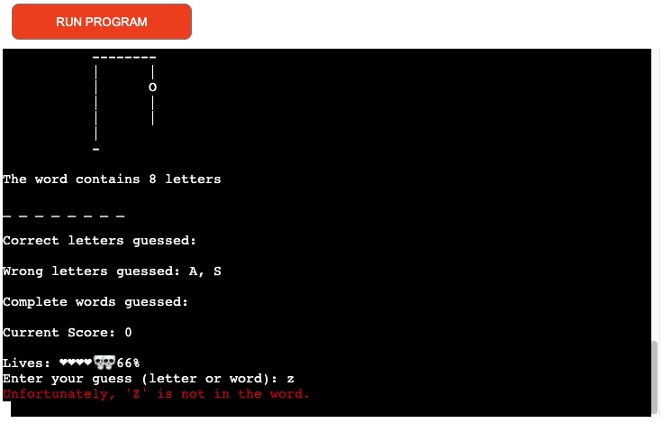
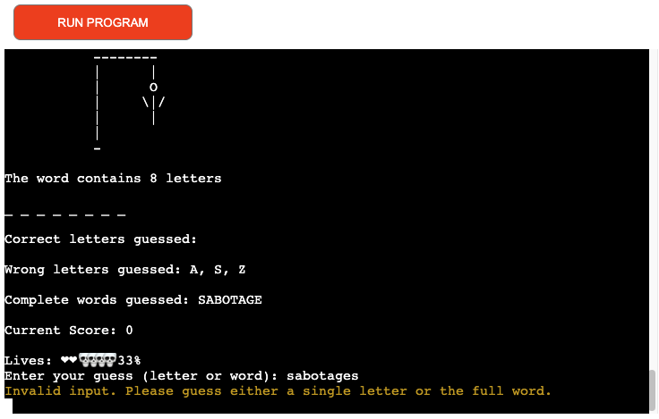
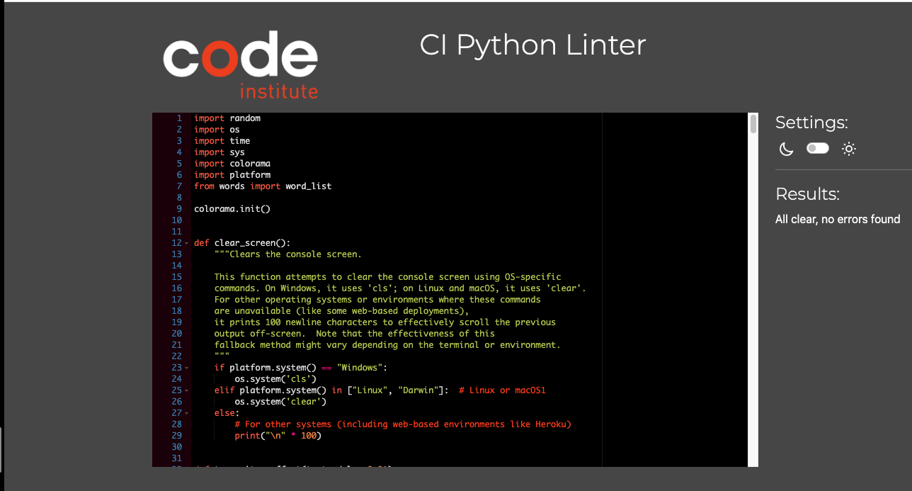
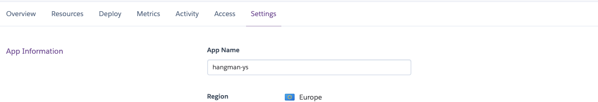
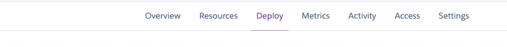

# Hangman 
Hangman is a Python-based terminal game that operates within the Code Institute's simulated terminal environment and is hosted on Heroku.

In this game, players will be challenged to figure out a randomly chosen word. They can make guesses by typing individual letters or entire words. The aim is to correctly guess the word and save the character from being hanged before running out of attempts.

[View live project here.](https://hangman-ys-2df0aca42caa.herokuapp.com/)

## How to play
The game begins by prompting players to enter their codename, commencing the immersive mission narrative presented in the welcome message.

A word related to espionage is randomly selected, with underscores (_) indicating each letter, revealing the total letters to players.

Players guess letters or the entire word, aiming to decode the secret word and rescue Agent 003. Ensure that guesses meet English alphabet criteria, with word guesses matching the length of the secret word.

Correct letter guesses replace underscores with the right letters. Each incorrect guess costs a life, bringing the character closer to capture depicted through the 'fall from the tree' sequence.

Success results in a congratulatory sequence and an option to play again, while failure reveals the word and offers retry encouragement.

Repeated guesses on letters previously tried don't incur penalties, guiding players to think strategically.

For additional details on gameplay strategies and the narrative, refer to the mission outlined in the Welcome Message.

## Game Mechanics 
A flowchart detailing the game's mechanics was designed using [draw.io](https://app.diagrams.net/ "draw.io"). Before diving into coding, I always draft a plan, sketching out the code structure, which is why I opted for the same method in my flowchart. You can view the flowchart by clicking the link below.

[Game Flowchart](docs/flowchart/hangmandraw.png)

## Features

### Welcome Message 

When the game loads, users will see a welcome message explaining the gameplay and instructions on how to start.

The welcome message for "Hangman Adventure: The Word Quest" immerses players into an exciting narrative of word-solving and espionage. Framed by a decorative border, it sets an adventurous tone right from the start with a well-structured format, drawing players into the game's challenge.

The introductory exposition presents the player with a mission: to decode the secret word and rescue the stick figure, known as Agent 003. This introduction not only establishes the game's main objective but also integrates a narrative element, elevating the player's role from mere participant to crucial savior. Agent 003 is in a precarious situation; his fate is significantly tied to the player's ability to solve the puzzles.

Crucially, the message includes a motivational phrase: "Each correct guess brings you closer to saving the agent, while every mistake deepens their peril—their very survival depends on you." This line serves to enhance the stakes of each decision, making it clear that every action, whether successful or not, has direct consequences on the agent's survival. This ties deeply into the game's plot, promoting careful consideration and strategic thinking.

The welcome message continues by outlining the gameplay rules, known as the "Rules of Engagement," to guide the player’s actions within the game:

* Guessing Mechanics: Players are allowed to guess individual letters or attempt the entire word, which adds strategic depth.

* Consequences of Mistakes: Incorrect guesses bring the stick figure perilously closer to a dire fate, building tension and urgency.

* Letter Restrictions: The game requires that guesses use only standard English letters, ensuring clarity.

* Thematic Words: The choice of words is inspired by espionage, subtly shaping the game's backdrop and maintaining thematic consistency.

* Word Length Requirement: Any attempt to guess the entire word must match the length of the secret word exactly.

Finally, it prompts the player with an invitation to start: "Are you ready to begin your lexical journey?" This query not only appeals to their sense of adventure but also reinforces their integral role in the forthcoming challenge. The typewriter effect used in displaying the message further engages the player, evoking a sense of mystery and nostalgia reminiscent of classic spy movies, enhancing the overall atmosphere of secrecy and suspense.

### Username Promtp

#### Agent Name Requirements (Username):

* The name must be between 1 and 10 characters in length.

* Only letters from the standard English alphabet are allowed—no numbers, spaces, or special characters.

If a player attempts to enter an invalid agent name, they will receive an error message explaining the issue and prompting them to enter a valid name. Once a compliant agent name is provided, the game will proceed, immersing the player in the espionage-themed challenge. This step ensures that each player starts with a unique and valid identifier, enhancing both personalization and the thematic experience of the game.

*Username Input* 

*Username Input* 

### Hangman Gallows

At the start of the game, players will see the empty gallows, setting the stage for the espionage-themed challenge. As players make incorrect guesses, the gallows will progressively reveal elements of the agent being captured and hanged. When the player exhausts all allowed attempts, the complete rendering of the captured and hanged agent will be displayed, indicating the end of the game.

*Start of Game* 

*Incorrect Guess* 

### Word

A word will be randomly selected from a carefully curated list of espionage-themed words. Each letter of the chosen word will initially be masked by an **_** symbol. As players correctly guess letters, these symbols will be replaced with the guessed letters in their respective positions within the word. This process continues until the word is fully revealed or the player runs out of attempts.

As the game progresses, each correctly guessed letter will be revealed in the word, while incorrectly guessed letters or words will be noted separately. All correct and incorrect guesses will be cataloged in their respective sections, allowing players to keep track of their progress and previously attempted guesses. This feature helps players strategize and avoid repeating mistakes.

1. Feedback on Guesses: 

* When you guess a letter that is in the word, a notification will momentarily appear in green, signifying a correct guess.
If the letter is not in the word, the notification will display in red, indicating a wrong guess.

2. Persistent Feedback: 

* The color of the notification (red for incorrect, green for correct) will remain at the top of the game interface until you make another guess, ensuring you remember your last guess's outcome.

*Letters Guessed Correctly* 

*Letters Guessed Incorrectly* 

### List of Guessed Words

If a player incorrectly guesses a word, it will be added to a list of incorrect word attempts. This list is displayed to the player, providing a clear record of unfruitful guesses, assisting in formulating future strategies, and preventing repeated attempts.

*Word Guessed* 

### Guess Validation 

If a player attempts to guess multiple letters and the length of the guess does not match the length of the word, an error message will notify them that the guess is invalid. Similarly, if a player submits a character not from the standard English alphabet, they will receive a notification that their input is not valid. These alerts help maintain the integrity of gameplay by ensuring all guesses align with the game's rules.

If you enter a word that does not match the required length or includes invalid characters such as numbers or special symbols, a notification will be displayed in orange. This serves as an alert to check your input and ensure it fits the criteria of the game.

*Incorrect Word Length Validation* 

*Incorrect Character Guess* 

### Game Outcome Notification

Upon finishing the game, players will receive a completion message that reflects the outcome of their gameplay. This message will either celebrate their success with a congratulatory note if they guessed the word correctly or provide a commiseratory remark if they did not succeed, encouraging them to improve and try again. The completion message serves as a closing interaction, summarizing the player's gaming experience.

* The animation sequence provides a rewarding visual experience for players, celebrating their successful effort in saving the agent, symbolized by the hangman figure. When a player correctly guesses the secret word, the hangman animates across the screen, signifying the agent's safe escape. This engaging visual reward adds a lively and gratifying conclusion to the game, making the achievement feel tangible and fun, enhancing the overall enjoyment of playing the game.

*Walking out Animation* 

* The "fall from the tree" animation sequence adds a dramatic conclusion to the game when the player fails to correctly guess the secret word. As a final gesture before the animation, the game briefly reveals the correct word, allowing the player to see what was missed. Following this revelation, the animation depicts the hangman figure—a representation of the agent—falling from the gallows. 

This visual sequence serves as a stark contrast to the rewarding save animation and underscores the consequence of failure. Accompanied by the message "You failed to save me, Agent," it enhances the emotional depth of the game by dramatizing the stakes and reinforcing the urgency of the player's mission. Showing the secret word momentarily emphasizes the outcome and reflects on the challenge, making the gameplay experience more immersive and impactful.

*Failure Acknowledgment* 

*Failure Animation* 

### Replay Option

After the game concludes, whether with a win or a loss, players are prompted to decide whether to play again by entering Y for yes or N for no. Input validation ensures that if a player enters any character other than Y or N, they receive an error message indicating invalid input. The game accommodates lowercase entries and full words such as "yes" or "no." It handles these by converting the first letter to uppercase for consistent processing.

*Replay Option Validation* 

### Scoring for Motivation

1. Purpose of the Scoring System:

- The scoring system is designed as a motivational tool to enhance player engagement and enjoyment. It provides immediate feedback on performance and serves as a measure of progress throughout each individual game. Note that the points are temporary and do not persist beyond the current game session.

2. Mechanics:

- Correct Guesses: Each correct letter guessed earns the player points, bringing them closer to their goal of saving the agent. This positive reinforcement encourages players to think carefully about their choices and rewards successful strategies.
Incorrect Guesses: With each incorrect guess, points are deducted, reflecting the increasing peril of the agent. This adds an element of challenge and urgency, motivating players to improve their guessing accuracy.

3. Narrative Integration:

- The points system ties into the game's narrative by simulating the urgency of the mission. Each point gained or lost reflects the agent's journey towards safety or danger, adding depth to the game's stakes.

4. Enjoyment and Motivation:

- While the points don't persist beyond a single game session, they serve as a fun challenge and personal achievement tracker. There is no system for maintaining scores between games or creating a leaderboard. They offer players a sense of accomplishment with each successful guess and emphasize the importance of each decision during play.

*Scoring for Motivation* 

### Life Bar

The life bar in "Hangman Adventure: The Word Quest" begins at 100% and decreases with each incorrect guess. This visual representation of remaining attempts adds urgency to the game, challenging players to choose their guesses wisely. As the life bar approaches zero, the tension mounts, emphasizing the critical nature of each decision in the mission to save Agent 003.

*Life Bar* 

### Validator Testing

To ensure code quality and adherence to PEP 8 standards, each file in this project was validated using the [CI Python Linter](https://pep8ci.herokuapp.com/).

Code Style Note for run.py

In our run.py file, which contains the main game logic for Hangman, there are some style warnings that may be triggered when analyzed by linters. These warnings are all W291: Trailing whitespace, occurring on lines 57, 66, 75, 84, 91, 92, 93, 99, 100, 101, and 102. Trailing whitespace refers to extra spaces at the end of code lines.

It's important to understand that these style suggestions don't affect the game's functionality or execution in any way. They're purely cosmetic recommendations from the PEP 8 style guide for Python.

The Hangman game runs correctly and provides the full intended experience regardless of these warnings in run.py. Players can enjoy all features - guessing letters, decoding words, and immersing in the secret agent theme - without any impact from these style considerations.

For the moment, we've decided to keep the code in run.py as it is. However, if we discover any problems, bugs, or issues affecting the game, we will fix them immediately. We want to emphasize that these particular style warnings in run.py do not affect the game or the code's functionality in any way.

We may address these style issues in future updates, but they don't detract from the current gameplay. Enjoy your Hangman adventure, agents!

*run.py Validation* 

*words.py Validation Clear* 

### Comprehensive Testing and Commitment to Quality ( Bugs)

We're pleased to report that during our extensive testing of the Hangman game, we did not encounter any bugs or issues that would impact the overall gameplay experience. The core functionality, including the ability to guess letters, decode the hidden word, and navigate the visual representation of the hangman, has been thoroughly validated and proven to work correctly.

However, it's important to note that the absence of identified bugs in our testing does not guarantee the complete absence of any potential issues. Software development, by its very nature, involves an element of uncertainty, and unforeseen problems can always arise, even in the most well-designed and extensively tested applications.

Therefore, we want to assure our players that we will remain vigilant and continue to monitor the Hangman game closely for any reports of bugs or unexpected behaviors. If any issues are brought to our attention, either through player feedback or our own ongoing monitoring, we will address them swiftly and efficiently.

Our commitment to delivering a seamless and enjoyable Hangman experience is unwavering. We have carefully implemented all the features and mechanics you would expect in a classic Hangman game, and we are confident that the game functions as intended. But we also recognize that software is a living, evolving entity, and we will remain dedicated to maintaining the highest standards of quality and responsiveness to any concerns that may arise.

Rest assured, agents, that we will continue to closely monitor the Hangman game and address any bugs or issues that may surface in the future. Your satisfaction and the integrity of the game experience are of the utmost importance to us.

### Languages used built in packages and Third-Party Libraries

* The **requests** library was utilized in the game, with words carefully crafted around an espionage theme to enhance the immersive experience.
* The **random** module was used to select words unpredictably from the list of options.
* The **os** module was employed to manage console interactions, allowing the screen to be cleared dynamically for a cleaner game interface.
* The **time** module was used to control timing, creating delays for animations and effects to enhance user engagement.
* The **sys** module facilitated output manipulation, enabling text to display gradually for a typewriter effect, enriching the visual experience.

## Development and Deployment

### Deployment

This project was deployed on [Heroku](https://www.heroku.com "Heroku") using the steps outlined below.

1. Visit the Heroku website and either register for an account or log in if you already have one.

*Heroku Login* 

2. Go to your dashboard, choose New, and then select Create New App.

*Dashboard* 

*New APP* 

3. Enter a distinct name for your application, pick your region, and click Create app.

*Application Name* 

4. Switch to the Settings tab.

*Settings Section* 

5. To employ the CodeInstitute's mock terminal setup, you need to add a configuration variable. Do this by clicking on Reveal Config Vars, entering PORT as the key, and 8000 as the value.

*Configuration Variable* 

6. Select Add Buildpack and include the Python and NodeJS packs in that sequence. Ensure Python is on top and NodeJS is below it upon completion.

*Buildpack* 

#### Deploying from Heroku choosing GitHub Deployment Method

1. Go to the Deploy tab.

*Deploy Tab* 

2. Choose GitHub - Connect as your deployment method and log in to link your GitHub account when prompted.

*Choose GitHub* 

3. Select your GitHub account from the dropdown if it's not already selected.

*GitHub Account* 

4. Look for the repository you wish to deploy, and click Connect next to the desired repository in the search results.
5. Further down the Deploy tab, you will find options for Automatic Deploys and Manual Deploy. Enabling automatic deploys allows Heroku to update your app whenever changes are made to your GitHub repository.
6. Decide on a deployment method and select the branch you wish to deploy from.

*Automatic and Manual Deploy* 

7. If opting for Automatic Deploys, click Enable Automatic Deploys. If choosing Manual Deploy, click Deploy Branch.
8. Heroku will begin the deployment process. Once completed, you'll receive a confirmation message stating Your app was successfully deployed, along with a button to view your live application.

### Code Manual Testing

| Feature Tested | Feature Description | Testing Completed | Expected Outcome | Result |
|-----------------|---------------------|-------------------|-------------------|--------|
| Welcome Message | Introductory message and username input field displayed. | Initiate program. | Welcome message and username input field should be displayed. | Confirmed. |
| Username Validation | User can input username adhering to specified requirements. | Input invalid and valid usernames. | Upon invalid username input, user will be notified and prompted to retry. Upon valid input, game will commence. | Verified. |
| Word Selection | Target word retrieved from primary database or backup list. | Attempt retrieval from primary database and backup list. Verified via console output. Database access simulated as unavailable to test backup. | Word should be selected at random from primary database or from backup list if primary retrieval fails. | Successful. |
| Game Initiation | Start message appears with user's username. | Input username to initiate game. | Start message should appear, incorporating user's username. | Confirmed. |
| Hangman Visualization | Display hangman diagram at different stages. | Start game to display initial state and intentionally lose lives to visualize further stages. | Hangman diagram should initially display empty and update with each incorrect guess. | As designed. |
| Word Length Notification | User notified of the target word's length. | Begin game to trigger word length notification. | Message with length of target word should be displayed. | Confirmed. |
| Word Masking | Word displayed with every letter initially hidden. | Start game to initiate display of masked word. | Target word should be displayed as a series of underscores equal to its length. | Verified. |
| Guess Input | Input field for user to submit guesses. | Initiate game to access guess input field. | Guess input field should appear in game interface. | Functional. |
| Guess Validation | Validates user's guess attempts. | Submit valid and invalid guesses. | Upon invalid guess, user should be notified without penalty. If guess has been previously made, user should be alerted. If valid, user should receive feedback on guess accuracy. | As expected. |
| Word Update | Upon successful letter guess, masked word updates to reveal correct letter. | Successfully guess a letter. | If letter guessed is correct, masked word should update to reveal correct letter at appropriate position. | Confirmed. |
| Guessed Letters Log | Any letters guessed added to log and displayed for user. | Attempt letter guesses. | When a letter is guessed by user, guessed letters log should update and be displayed. | Verified. |
| Guessed Words Log | Incorrect word guesses logged and displayed for user. If correct word guessed, game concludes. | Attempt word guesses. | When an incorrect word is guessed, words log updated and displayed. If correct word is guessed, game should conclude. | As designed. |
| Game Outcome Message | Upon game conclusion, message displayed indicating win or loss. | Complete game through win and loss scenarios. | When user wins, congratulatory message should display. When user loses, commiserative message should appear. | Confirmed. |
| Play Again Prompt | Upon game conclusion, user is asked about playing another round. | Conclude game. | When game completed, prompt should appear allowing user to exit program or start new game. Program should restart if user accepts and terminate if user declines. | Verified. |
| Play Again Validation | Validate play again response from user. | Provide invalid input to play again prompt. | If user provides invalid input to play again prompt, they should be notified and allowed to input again. | As expected. |

## Credits

- [CodeInstitute](https://codeinstitute.net/ "Code Institute") I am deeply grateful to the Code Institute and its dynamic Slack community of tutors and mentors. Your ongoing support, expert guidance, and encouragement have been vital to my educational journey and the successful completion of this project. Your commitment has greatly enhanced my learning experience.

- I would also like to express my gratitude to my amazing wife Fatty and my little brother Mett for their invaluable testing and feedback.

- A big thank you to my mentor, [Iuliia Konovalova](https://github.com/IuliiaKonovalova), for her guidance and support throughout this project. Your mentorship made all the difference!

- [GitHub](https://github.com/) A sincere acknowledgment to the creators of GitHub. Their platform has transformed the way we collaborate and learn in coding, serving as more than just a tool—it has been a key driver in my growth as a developer.

- The initial idea and basic understanding for this classic Hangman game were inspired by a tutorial from the YouTube channel [Kite](https://www.youtube.com/@KiteHQ). This tutorial, which can be viewed here [tutorial](https://www.youtube.com/watch?v=m4nEnsavl6w&t=463s&ab_channel=Kite).