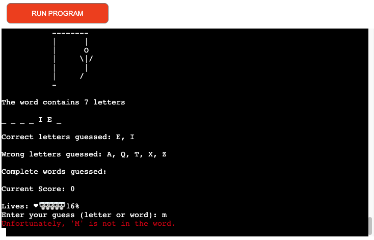
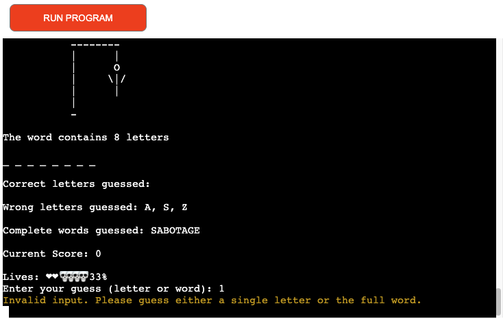

# Hangman 
Hangman is a Python-based terminal game that operates within the Code Institute's simulated terminal environment and is hosted on Heroku.

In this game, players will be challenged to figure out a randomly chosen word. They can make guesses by typing individual letters or entire words. The aim is to correctly guess the word and save the character from being hanged before running out of attempts.

[View live project here.](https://hangman-ys-2df0aca42caa.herokuapp.com/)

## How to play
Initially, players will be prompted to enter their name, which will start the game.

A word related to espionage will be randomly selected, with each letter represented by an **_** symbol, revealing the total number of letters in the word.

Players will then be asked to enter a letter or attempt to guess the entire word.

Guesses must consist of letters from the English alphabet. Word guesses must match the length of the given word and only include English alphabet characters.

Correct letter guesses will replace the corresponding **_** symbols with the correct letters. For each incorrect guess, whether a letter or a whole word, the player will lose a life, bringing the character one step closer to being captured and hanged.

Upon successfully identifying the word, players will receive a congratulatory message and an option to play again.

If players run out of lives, the character will, unfortunately, be captured and hanged. A message of commiseration will be presented, along with an opportunity to try again.

Players will also be reminded of any letters they have already guessed, prompting them to guess again without losing a life for repeated guesses.

## Game Mechanics 
A flowchart detailing the game's mechanics was designed using [draw.io](https://app.diagrams.net/ "draw.io"). Before diving into coding, I always draft a plan, sketching out the code structure, which is why I opted for the same method in my flowchart. You can view the flowchart by clicking the link below.

[Game Flowchart](docs/flowchart/hangmandraw.png)

## Features

### Welcome Message 

When the game loads, users will see a welcome message explaining the gameplay and instructions on how to start.

### Username Promtp

#### Agent Name Requirements (Username):

* The name must be between 1 and 10 characters in length.

* Only letters from the standard English alphabet are allowed—no numbers, spaces, or special characters.

If a player attempts to enter an invalid agent name, they will receive an error message explaining the issue and prompting them to enter a valid name. Once a compliant agent name is provided, the game will proceed, immersing the player in the espionage-themed challenge. This step ensures that each player starts with a unique and valid identifier, enhancing both personalization and the thematic experience of the game.

*Username Input* 

*Username Input* 

### Hangman Gallows

At the start of the game, players will see the empty gallows, setting the stage for the espionage-themed challenge. As players make incorrect guesses, the gallows will progressively reveal elements of the agent being captured and hanged. When the player exhausts all allowed attempts, the complete rendering of the captured and hanged agent will be displayed, indicating the end of the game.

*Start of Game* 

*Incorrect Guess* 

### Word

A word will be randomly selected from a carefully curated list of espionage-themed words. Each letter of the chosen word will initially be masked by an **_** symbol. As players correctly guess letters, these symbols will be replaced with the guessed letters in their respective positions within the word. This process continues until the word is fully revealed or the player runs out of attempts.

As the game progresses, each correctly guessed letter will be revealed in the word, while incorrectly guessed letters or words will be noted separately. All correct and incorrect guesses will be cataloged in their respective sections, allowing players to keep track of their progress and previously attempted guesses. This feature helps players strategize and avoid repeating mistakes.

*Letters Guessed Correctly* 

*Letters Guessed Incorrectly* 

### List of Guessed Words

If a player incorrectly guesses a word, it will be added to a list of incorrect word attempts. This list is displayed to the player, providing a clear record of unfruitful guesses, assisting in formulating future strategies, and preventing repeated attempts.

*Word Guessed* 

### Guess Validation 

If a player attempts to guess multiple letters and the length of the guess does not match the length of the word, an error message will notify them that the guess is invalid. Similarly, if a player submits a character not from the standard English alphabet, they will receive a notification that their input is not valid. These alerts help maintain the integrity of gameplay by ensuring all guesses align with the game's rules.

*Incorrect Word Length Validation* 

*Incorrect Character Guess* 

### Game Outcome Notification

Upon finishing the game, players will receive a completion message that reflects the outcome of their gameplay. This message will either celebrate their success with a congratulatory note if they guessed the word correctly or provide a commiseratory remark if they did not succeed, encouraging them to improve and try again. The completion message serves as a closing interaction, summarizing the player's gaming experience.

*Congratulatory Message* 

*Failure Acknowledgment* 

### Replay Option

After the game concludes, whether with a win or a loss, players are prompted to decide whether to play again by entering Y for yes or N for no. Input validation ensures that if a player enters any character other than Y or N, they receive an error message indicating invalid input. The game accommodates lowercase entries and full words such as "yes" or "no." It handles these by converting the first letter to uppercase for consistent processing.

*Replay Option Validation* 

### Testing 

| Feature Tested | Feature Description | Testing Completed | Expected Outcome | Result |
|-----------------|---------------------|-------------------|-------------------|--------|
| Welcome Message | Introductory message and username input field displayed. | Initiate program. | Welcome message and username input field should be displayed. | Confirmed. |
| Username Validation | User can input username adhering to specified requirements. | Input invalid and valid usernames. | Upon invalid username input, user will be notified and prompted to retry. Upon valid input, game will commence. | Verified. |
| Word Selection | Target word retrieved from primary database or backup list. | Attempt retrieval from primary database and backup list. Verified via console output. Database access simulated as unavailable to test backup. | Word should be selected at random from primary database or from backup list if primary retrieval fails. | Successful. |
| Game Initiation | Start message appears with user's username. | Input username to initiate game. | Start message should appear, incorporating user's username. | Confirmed. |
| Hangman Visualization | Display hangman diagram at different stages. | Start game to display initial state and intentionally lose lives to visualize further stages. | Hangman diagram should initially display empty and update with each incorrect guess. | As designed. |
| Word Length Notification | User notified of the target word's length. | Begin game to trigger word length notification. | Message with length of target word should be displayed. | Confirmed. |
| Word Masking | Word displayed with every letter initially hidden. | Start game to initiate display of masked word. | Target word should be displayed as a series of underscores equal to its length. | Verified. |
| Guess Input | Input field for user to submit guesses. | Initiate game to access guess input field. | Guess input field should appear in game interface. | Functional. |
| Guess Validation | Validates user's guess attempts. | Submit valid and invalid guesses. | Upon invalid guess, user should be notified without penalty. If guess has been previously made, user should be alerted. If valid, user should receive feedback on guess accuracy. | As expected. |
| Word Update | Upon successful letter guess, masked word updates to reveal correct letter. | Successfully guess a letter. | If letter guessed is correct, masked word should update to reveal correct letter at appropriate position. | Confirmed. |
| Guessed Letters Log | Any letters guessed added to log and displayed for user. | Attempt letter guesses. | When a letter is guessed by user, guessed letters log should update and be displayed. | Verified. |
| Guessed Words Log | Incorrect word guesses logged and displayed for user. If correct word guessed, game concludes. | Attempt word guesses. | When an incorrect word is guessed, words log updated and displayed. If correct word is guessed, game should conclude. | As designed. |
| Game Outcome Message | Upon game conclusion, message displayed indicating win or loss. | Complete game through win and loss scenarios. | When user wins, congratulatory message should display. When user loses, commiserative message should appear. | Confirmed. |
| Play Again Prompt | Upon game conclusion, user is asked about playing another round. | Conclude game. | When game completed, prompt should appear allowing user to exit program or start new game. Program should restart if user accepts and terminate if user declines. | Verified. |
| Play Again Validation | Validate play again response from user. | Provide invalid input to play again prompt. | If user provides invalid input to play again prompt, they should be notified and allowed to input again. | As expected. |

### Validator Testing

To ensure code quality and adherence to PEP 8 standards, each file in this project was validated using the [CI Python Linter](https://pep8ci.herokuapp.com/).

Code Style Note for run.py

In our run.py file, which contains the main game logic for Hangman, there are some style warnings that may be triggered when analyzed by linters. These warnings are all W291: Trailing whitespace, occurring on lines 57, 66, 75, 84, 91, 92, 93, 99, 100, 101, and 102. Trailing whitespace refers to extra spaces at the end of code lines.

It's important to understand that these style suggestions don't affect the game's functionality or execution in any way. They're purely cosmetic recommendations from the PEP 8 style guide for Python.

The Hangman game runs correctly and provides the full intended experience regardless of these warnings in run.py. Players can enjoy all features - guessing letters, decoding words, and immersing in the secret agent theme - without any impact from these style considerations.

For the moment, we've decided to keep the code in run.py as it is. However, if we discover any problems, bugs, or issues affecting the game, we will fix them immediately. We want to emphasize that these particular style warnings in run.py do not affect the game or the code's functionality in any way.

We may address these style issues in future updates, but they don't detract from the current gameplay. Enjoy your Hangman adventure, agents!

*run.py Validation* 

*words.py Validation Clear* 

- Code Style Note for run.py and words.py !!!

In our Hangman game, you may notice the use of # noqa comments in the run.py and words.py files. These comments are used to suppress specific style warnings that are reported by code linters, such as pycodestyle or flake8.

The # noqa comment tells the linter to ignore the warning on the line where it's used. This is a common practice when the style warning does not indicate a functional issue with the code, and the developer decides to prioritize other development tasks over immediately addressing the style concern.

In the case of our Hangman game, the style warnings being suppressed are mostly related to:

1. Trailing Whitespace (W291): As mentioned earlier, these warnings indicate the presence of extra spaces or tabs at the end of code lines. While keeping the code clean and following style guidelines is generally recommended, these particular warnings do not affect the game's functionality.

2. Line Length (E501): Certain lines in run.py and words.py may exceed the recommended maximum line length. Again, this is a stylistic concern and does not impact the game's performance or behavior.

By using # noqa, the development team can focus on more pressing concerns, such as implementing new features, fixing bugs, or improving the overall user experience, without being distracted by these minor style issues.

Rest assured that the use of # noqa does not compromise the quality or integrity of the Hangman game. The code will continue to function as intended, and the development team remains committed to addressing any genuine problems or bugs that may arise.

### Comprehensive Testing and Commitment to Quality ( Bugs)

We're pleased to report that during our extensive testing of the Hangman game, we did not encounter any bugs or issues that would impact the overall gameplay experience. The core functionality, including the ability to guess letters, decode the hidden word, and navigate the visual representation of the hangman, has been thoroughly validated and proven to work correctly.

However, it's important to note that the absence of identified bugs in our testing does not guarantee the complete absence of any potential issues. Software development, by its very nature, involves an element of uncertainty, and unforeseen problems can always arise, even in the most well-designed and extensively tested applications.

Therefore, we want to assure our players that we will remain vigilant and continue to monitor the Hangman game closely for any reports of bugs or unexpected behaviors. If any issues are brought to our attention, either through player feedback or our own ongoing monitoring, we will address them swiftly and efficiently.

Our commitment to delivering a seamless and enjoyable Hangman experience is unwavering. We have carefully implemented all the features and mechanics you would expect in a classic Hangman game, and we are confident that the game functions as intended. But we also recognize that software is a living, evolving entity, and we will remain dedicated to maintaining the highest standards of quality and responsiveness to any concerns that may arise.

Rest assured, agents, that we will continue to closely monitor the Hangman game and address any bugs or issues that may surface in the future. Your satisfaction and the integrity of the game experience are of the utmost importance to us.